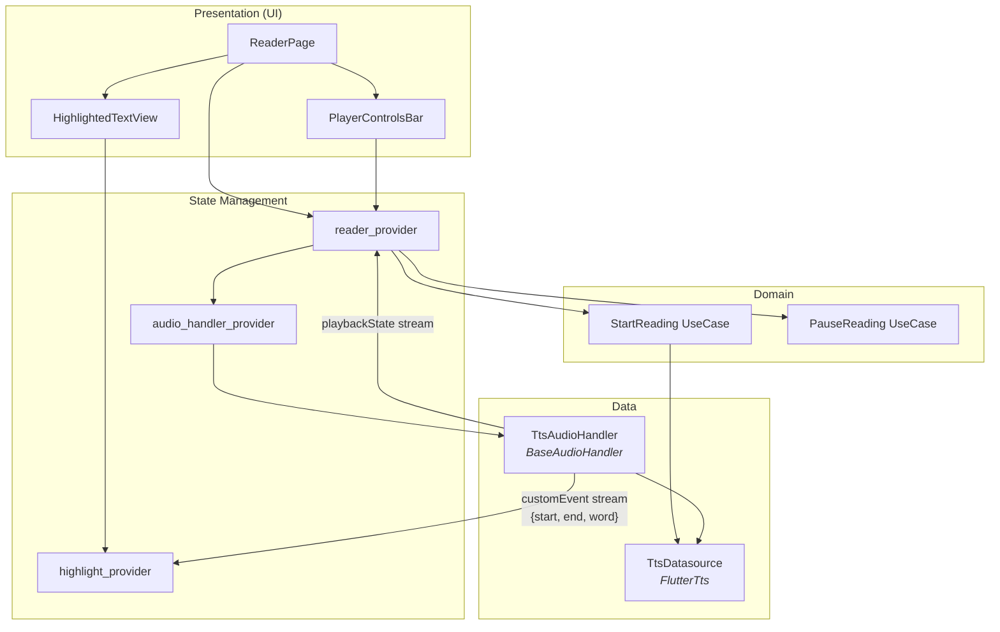

# PDF Readcloud — Architecture & Implementation Plan

## 1. Goal

Build a Flutter mobile app ("PDF Readcloud") that reads PDF files aloud with real-time word-by-word karaoke highlighting, background playback with OS media controls, Firebase auth/persistence, and RevenueCat subscriptions — all structured around **Feature-first Clean Architecture**.

---

## 2. User Review Required

> [!IMPORTANT]
> **Syncfusion License** — `syncfusion_flutter_pdf` is a commercial package. You must obtain a **free Community License** (for individuals / companies with < $1M revenue) or a commercial license from [syncfusion.com](https://www.syncfusion.com/products/communitylicense). An alternative is the MIT-licensed `pdf_text` package, but it has weaker extraction quality. Please confirm which you'd like to use.

> [!WARNING]
> **RevenueCat API Key** — You'll need to create a RevenueCat project and configure products/entitlements in the dashboard before the subscription feature can be tested. This plan stubs the integration so development can proceed independently.

> [!IMPORTANT]
> **Firebase Setup** — You must create a Firebase project, enable Google Sign-In under Authentication, create a Firestore database, and download the `google-services.json` (Android) / `GoogleService-Info.plist` (iOS) config files. This plan assumes these files are available at build time.

---

## 3. Project Structure (Feature-first Clean Architecture)

```
lib/
├── main.dart                            # Entry point: initializes AudioService, Firebase, Riverpod
├── app.dart                             # MaterialApp / GoRouter setup
├── bootstrap.dart                       # Async initialization orchestrator
│
├── core/                                # Shared infrastructure (framework-agnostic)
│   ├── constants/
│   │   ├── app_colors.dart              # Color palette
│   │   ├── app_text_styles.dart         # Typography
│   │   ├── app_dimensions.dart          # Spacing, radius, breakpoints
│   │   └── asset_paths.dart             # Asset string constants
│   ├── errors/
│   │   ├── failures.dart                # Failure sealed class hierarchy
│   │   └── exceptions.dart              # Custom exception types
│   ├── extensions/
│   │   ├── string_ext.dart
│   │   ├── context_ext.dart
│   │   └── list_ext.dart
│   ├── router/
│   │   ├── app_router.dart              # GoRouter config with guards
│   │   └── route_names.dart             # Named route constants
│   ├── theme/
│   │   ├── app_theme.dart               # ThemeData (light/dark)
│   │   └── widget_themes.dart           # Component-level theme overrides
│   ├── utils/
│   │   ├── logger.dart                  # Logging utility
│   │   ├── debouncer.dart
│   │   └── platform_utils.dart
│   └── widgets/                         # Reusable generic widgets
│       ├── app_button.dart
│       ├── app_loading.dart
│       ├── app_error_widget.dart
│       └── gradient_scaffold.dart
│
├── features/
│   │
│   ├── auth/                            # ── AUTHENTICATION FEATURE ──
│   │   ├── data/
│   │   │   ├── datasources/
│   │   │   │   └── firebase_auth_datasource.dart
│   │   │   └── repositories/
│   │   │       └── auth_repository_impl.dart
│   │   ├── domain/
│   │   │   ├── entities/
│   │   │   │   └── app_user.dart
│   │   │   ├── repositories/
│   │   │   │   └── auth_repository.dart          # Abstract interface
│   │   │   └── usecases/
│   │   │       ├── sign_in_with_google.dart
│   │   │       ├── sign_out.dart
│   │   │       └── get_current_user.dart
│   │   └── presentation/
│   │       ├── providers/
│   │       │   └── auth_provider.dart            # Riverpod + codegen
│   │       ├── pages/
│   │       │   ├── login_page.dart
│   │       │   └── splash_page.dart
│   │       └── widgets/
│   │           └── google_sign_in_button.dart
│   │
│   ├── pdf_library/                     # ── PDF LIBRARY / HOME FEATURE ──
│   │   ├── data/
│   │   │   ├── datasources/
│   │   │   │   ├── local_pdf_datasource.dart     # File picker + local storage
│   │   │   │   └── firestore_library_datasource.dart
│   │   │   └── repositories/
│   │   │       └── pdf_library_repository_impl.dart
│   │   ├── domain/
│   │   │   ├── entities/
│   │   │   │   └── pdf_document_info.dart
│   │   │   ├── repositories/
│   │   │   │   └── pdf_library_repository.dart
│   │   │   └── usecases/
│   │   │       ├── import_pdf.dart
│   │   │       ├── get_pdf_list.dart
│   │   │       └── delete_pdf.dart
│   │   └── presentation/
│   │       ├── providers/
│   │       │   └── pdf_library_provider.dart
│   │       ├── pages/
│   │       │   └── library_page.dart
│   │       └── widgets/
│   │           ├── pdf_card.dart
│   │           └── import_fab.dart
│   │
│   ├── pdf_parser/                      # ── PDF TEXT EXTRACTION FEATURE ──
│   │   ├── data/
│   │   │   ├── datasources/
│   │   │   │   └── syncfusion_pdf_datasource.dart
│   │   │   └── repositories/
│   │   │       └── pdf_parser_repository_impl.dart
│   │   ├── domain/
│   │   │   ├── entities/
│   │   │   │   ├── parsed_page.dart              # Holds page text + metadata
│   │   │   │   └── parsed_document.dart
│   │   │   ├── repositories/
│   │   │   │   └── pdf_parser_repository.dart
│   │   │   └── usecases/
│   │   │       └── extract_text_from_pdf.dart
│   │   └── presentation/
│   │       └── providers/
│   │           └── pdf_parser_provider.dart
│   │
│   ├── reader/                          # ── READER / PLAYER FEATURE (★ CORE) ──
│   │   ├── data/
│   │   │   ├── datasources/
│   │   │   │   └── tts_datasource.dart           # FlutterTts wrapper
│   │   │   ├── models/
│   │   │   │   └── tts_progress_model.dart       # start, end, word offsets
│   │   │   └── repositories/
│   │   │       └── tts_repository_impl.dart
│   │   ├── domain/
│   │   │   ├── entities/
│   │   │   │   ├── reading_position.dart         # page index + char offset
│   │   │   │   ├── tts_config.dart               # voice, speed, pitch, lang
│   │   │   │   └── highlight_state.dart          # current word/sentence range
│   │   │   ├── repositories/
│   │   │   │   └── tts_repository.dart
│   │   │   └── usecases/
│   │   │       ├── start_reading.dart
│   │   │       ├── pause_reading.dart
│   │   │       ├── resume_reading.dart
│   │   │       ├── stop_reading.dart
│   │   │       ├── skip_to_page.dart
│   │   │       ├── change_voice.dart
│   │   │       └── change_speed.dart
│   │   └── presentation/
│   │       ├── providers/
│   │       │   ├── reader_provider.dart           # Orchestrates TTS + highlight
│   │       │   ├── highlight_provider.dart         # Stream of HighlightState
│   │       │   └── tts_config_provider.dart        # Voice/speed/lang selection
│   │       ├── pages/
│   │       │   └── reader_page.dart
│   │       └── widgets/
│   │           ├── highlighted_text_view.dart      # RichText karaoke widget
│   │           ├── player_controls_bar.dart        # Play/pause/prev/next
│   │           ├── speed_selector.dart
│   │           ├── voice_selector_sheet.dart
│   │           └── page_scrubber.dart              # Page navigation slider
│   │
│   ├── audio_handler/                   # ── BACKGROUND AUDIO SERVICE ──
│   │   ├── tts_audio_handler.dart       # BaseAudioHandler implementation
│   │   └── audio_handler_provider.dart  # Riverpod provider for the handler
│   │
│   ├── settings/                        # ── USER SETTINGS / PREFERENCES ──
│   │   ├── data/
│   │   │   ├── datasources/
│   │   │   │   ├── local_settings_datasource.dart     # SharedPreferences
│   │   │   │   └── firestore_settings_datasource.dart # Cloud sync
│   │   │   └── repositories/
│   │   │       └── settings_repository_impl.dart
│   │   ├── domain/
│   │   │   ├── entities/
│   │   │   │   └── user_settings.dart
│   │   │   ├── repositories/
│   │   │   │   └── settings_repository.dart
│   │   │   └── usecases/
│   │   │       ├── save_settings.dart
│   │   │       └── load_settings.dart
│   │   └── presentation/
│   │       ├── providers/
│   │       │   └── settings_provider.dart
│   │       └── pages/
│   │           └── settings_page.dart
│   │
│   └── subscription/                    # ── IN-APP PURCHASES ──
│       ├── data/
│       │   ├── datasources/
│       │   │   └── revenuecat_datasource.dart
│       │   └── repositories/
│       │       └── subscription_repository_impl.dart
│       ├── domain/
│       │   ├── entities/
│       │   │   ├── entitlement.dart
│       │   │   └── subscription_plan.dart
│       │   ├── repositories/
│       │   │   └── subscription_repository.dart
│       │   └── usecases/
│       │       ├── check_entitlement.dart
│       │       ├── purchase_subscription.dart
│       │       └── restore_purchases.dart
│       └── presentation/
│           ├── providers/
│           │   └── subscription_provider.dart
│           ├── pages/
│           │   └── paywall_page.dart
│           └── widgets/
│               └── premium_badge.dart
│
├── services/                            # Cross-cutting service singletons
│   ├── firebase_service.dart            # Firebase.initializeApp wrapper
│   └── file_service.dart                # File picker + permissions
│
└── generated/                           # Riverpod / build_runner output
    └── ...
```

---

## 4. Dependency Graph



---

## 5. Deep Dive: TTS + audio_service Word-Highlighting Synchronization

This is the most technically challenging aspect of the app. Here is the detailed strategy.

### 5.1 The Problem

We need to satisfy **two simultaneous requirements**:

| Requirement | Mechanism |
|---|---|
| **Background playback** with OS media controls (lock screen, notification) | `audio_service` — requires a `BaseAudioHandler` that owns the playback lifecycle |
| **Real-time word highlighting** in the UI | `flutter_tts` `setProgressHandler` — provides `(String text, int startOffset, int endOffset, String word)` on each word boundary |

The challenge: `audio_service`'s `BaseAudioHandler` is designed for scenarios that usually involve `just_audio` for actual audio file playback. Here we are not playing an audio file — we are synthesizing speech in real-time. We need the handler to:

1. Control `FlutterTts` (play/pause/stop) in response to OS media button events
2. Broadcast word-offset data from `setProgressHandler` back to the UI

### 5.2 The Solution: `TtsAudioHandler` Architecture

```dart
/// Lives as a singleton created during AudioService.init()
class TtsAudioHandler extends BaseAudioHandler {
  final FlutterTts _tts = FlutterTts();
  
  // ── Outbound streams to UI ──
  // customEvent is inherited from BaseAudioHandler.
  // We use it to stream word-highlight data:
  //   customEvent.add(TtsProgressModel(start, end, word))

  String _fullText = '';           // The entire text being spoken
  int _currentPageIndex = 0;
  int _pauseCharOffset = 0;        // Track position for Android pause workaround
  
  TtsAudioHandler() {
    // ① Wire up TTS progress → customEvent stream
    _tts.setProgressHandler((String text, int start, int end, String word) {
      _pauseCharOffset = start;     // Track for pause/resume
      customEvent.add({
        'type': 'progress',
        'start': start,
        'end': end,
        'word': word,
      });
    });
    
    // ② Wire up TTS completion → playbackState + auto-advance
    _tts.setCompletionHandler(() {
      customEvent.add({'type': 'pageComplete', 'pageIndex': _currentPageIndex});
      // The reader_provider listens to this and calls skipToNext()
    });
    
    // ③ Wire up TTS start
    _tts.setStartHandler(() {
      _broadcastPlaying();
    });
    
    // ④ Wire up pause/continue (iOS native; Android workaround)
    _tts.setPauseHandler(() => _broadcastPaused());
    _tts.setContinueHandler(() => _broadcastPlaying());
  }
```

### 5.3 Data Flow Sequence

```
┌─────────────────────────────────────────────────────────────────────┐
│                        RUNTIME FLOW                                 │
├─────────────────────────────────────────────────────────────────────┤
│                                                                     │
│  ┌──────────┐     play()      ┌──────────────────┐                 │
│  │  OS Lock  │ ──────────────→│  TtsAudioHandler  │                 │
│  │  Screen / │                │  (BaseAudioHandler)│                 │
│  │  Notif.   │ ←──────────────│                    │                 │
│  └──────────┘  playbackState  │  ┌──────────────┐ │                 │
│                               │  │  FlutterTts  │ │                 │
│                               │  │              │ │                 │
│  ┌──────────┐  customEvent    │  │ setProgress  │ │                 │
│  │  UI      │ ←───────────────│──│  Handler()   │ │                 │
│  │ Highlight│                 │  │ {start,end,  │ │                 │
│  │ Provider │                 │  │  word}       │ │                 │
│  └────┬─────┘                 │  └──────────────┘ │                 │
│       │                       └──────────────────────┘              │
│       ▼                                                             │
│  ┌──────────┐                                                       │
│  │ RichText │  Rebuilds with highlighted word span                 │
│  │ Widget   │                                                       │
│  └──────────┘                                                       │
└─────────────────────────────────────────────────────────────────────┘
```

### 5.4 Detailed Event Flow (Step-by-Step)

1. **User taps Play** → `reader_provider` calls `audioHandler.play()`
2. **`TtsAudioHandler.play()`** →
   - Sets `playbackState` to `playing: true` (OS notification updates)
   - Calls `_tts.speak(currentPageText)`
3. **`flutter_tts` starts speaking** → native TTS engine fires `onRangeStart` callbacks
4. **`setProgressHandler` fires** with `(text, startOffset, endOffset, word)` →
   - Handler stores `_pauseCharOffset = startOffset`
   - Handler emits via `customEvent.add({start, end, word})`
5. **UI's `highlight_provider`** listens to `audioHandler.customEvent` stream →
   - Updates `HighlightState(wordStart: start, wordEnd: end, currentWord: word)`
   - Also computes `sentenceStart / sentenceEnd` by scanning for `.` / `!` / `?` boundaries
6. **`HighlightedTextView` widget** rebuilds with `RichText` / `TextSpan`:
   - Before current word → default style
   - **Current sentence** → subtle background highlight
   - **Current word** → bold + accent color + slight scale animation
   - After current word → default style
7. **User taps Pause** (or OS lockscreen pause) → `audioHandler.pause()` →
   - Calls `_tts.pause()` (works natively on iOS)
   - On Android: `_tts.stop()` + records `_pauseCharOffset` (Android workaround)
   - Sets `playbackState` to `playing: false`
8. **User taps Resume** → `audioHandler.play()` →
   - On Android: calls `_tts.speak(text.substring(_pauseCharOffset))`
   - On iOS: calls `_tts.speak()` (native resume)
   - **Critical Android offset adjustment**: When speaking a substring, `setProgressHandler` offsets reset to 0. The handler adds `_pauseCharOffset` to the reported offsets before emitting via `customEvent`, so the UI highlights stay correct.
9. **TTS completes page** → `setCompletionHandler` fires →
   - Emits `{'type': 'pageComplete'}` via `customEvent`
   - `reader_provider` auto-advances: increments page, calls `audioHandler.playMediaItem(nextPage)`
10. **User taps Next/Previous** (OS or UI) → `audioHandler.skipToNext()` / `skipToPrevious()` →
    - Stops current TTS, loads next/prev page text, calls `speak()`

### 5.5 Android Pause/Resume Workaround

> [!WARNING]
> Android TTS does not support native pause. `flutter_tts` documents this explicitly. When `pause()` is called on Android, the plugin uses `onRangeStart()` to record the last word boundary. On `resume`, it re-invokes `speak()` with the **substring** from that boundary, which **resets the offset counters to 0**.

**Our mitigation:**

```dart
// Inside TtsAudioHandler
int _globalOffset = 0; // Cumulative offset from original text start

@override
Future<void> play() async {
  if (_isPaused && Platform.isAndroid) {
    // Resume from pause point
    _globalOffset = _pauseCharOffset;
    final remainingText = _fullText.substring(_pauseCharOffset);
    await _tts.speak(remainingText);
  } else {
    _globalOffset = 0;
    await _tts.speak(_fullText);
  }
  _isPaused = false;
  _broadcastPlaying();
}

// In setProgressHandler:
_tts.setProgressHandler((text, start, end, word) {
  final adjustedStart = start + _globalOffset;
  final adjustedEnd = end + _globalOffset;
  _pauseCharOffset = adjustedStart;
  customEvent.add({
    'type': 'progress',
    'start': adjustedStart,
    'end': adjustedEnd,
    'word': word,
  });
});
```

### 5.6 UI Highlighting Widget Strategy

The `HighlightedTextView` uses `RichText` with three `TextSpan` segments:

```dart
RichText(
  text: TextSpan(children: [
    // 1. Text BEFORE the current word
    TextSpan(
      text: pageText.substring(0, highlightState.wordStart),
      style: defaultStyle,
    ),
    // 2. The CURRENT WORD (highlighted)
    TextSpan(
      text: pageText.substring(highlightState.wordStart, highlightState.wordEnd),
      style: highlightedStyle, // bold + accent color + background
    ),
    // 3. Text AFTER the current word
    TextSpan(
      text: pageText.substring(highlightState.wordEnd),
      style: defaultStyle,
    ),
  ]),
)
```

For **sentence-level highlighting**, we wrap additional logic to detect sentence boundaries and apply a subtle background to the entire active sentence using a `WidgetSpan` with a `Container` or by nesting four `TextSpan` segments (before sentence, sentence-before-word, word, sentence-after-word, after sentence).

### 5.7 MediaItem Mapping

Each PDF page is modeled as a `MediaItem` for `audio_service`:

```dart
MediaItem(
  id: '${pdfId}_page_$pageIndex',
  title: pdfDocument.title,
  album: 'Page ${pageIndex + 1} of ${pdfDocument.pageCount}',
  artist: 'PDF Readcloud',
  duration: _estimateDuration(pageText, speechRate), // Rough estimate
  extras: {'pageIndex': pageIndex, 'pdfId': pdfId},
)
```

This gives the lock screen and notification a meaningful display.

---

## 6. Step-by-Step Implementation Roadmap

### Phase 1: Project Scaffolding
- Create the full folder structure under `lib/`
- Set up `pubspec.yaml` with all dependencies
- Configure `analysis_options.yaml` for Riverpod lints
- Create `bootstrap.dart` for async initialization

### Phase 2: Core Infrastructure
- Implement `core/theme/` (light/dark themes, typography)
- Implement `core/router/` with GoRouter
- Implement `core/errors/` (Failure/Exception hierarchy)
- Implement `core/widgets/` (shared UI components)
- Implement `core/constants/`

### Phase 3: Firebase & Auth Feature
- Integrate Firebase (add `firebase_core`, `firebase_auth`, `google_sign_in`, `cloud_firestore`)
- Create platform config files setup documentation
- Implement auth data layer (Firebase datasource → repository)
- Implement auth domain (entities, use cases)
- Implement auth presentation (login page, Riverpod providers)
- Add "skip login" / guest mode flow

### Phase 4: PDF Import & Library Feature
- Integrate `file_picker` for PDF selection
- Implement `pdf_library` data layer (local file storage + optional Firestore sync)
- Implement library UI (grid/list of imported PDFs with thumbnails)
- Implement delete/manage PDFs

### Phase 5: PDF Text Extraction Feature
- Integrate `syncfusion_flutter_pdf`
- Implement `pdf_parser` data layer (`PdfTextExtractor`)
- Create `ParsedDocument` entity (list of `ParsedPage` with text per page)
- Pre-process text: normalize whitespace, extract sentence boundaries
- Handle extraction errors (scanned PDFs, encrypted PDFs)

### Phase 6: TTS Audio Handler (★ Critical Path)
- Implement `TtsAudioHandler extends BaseAudioHandler`
- Wire `FlutterTts` inside the handler
- Implement `setProgressHandler` → `customEvent` bridge
- Implement Android pause/resume offset workaround
- Implement `play()`, `pause()`, `stop()`, `skipToNext()`, `skipToPrevious()`
- Broadcast `PlaybackState` with correct controls
- Map pages to `MediaItem` for notification display
- Register handler via `AudioService.init()` in `bootstrap.dart`

### Phase 7: Reader UI & Highlighting (★ Critical Path)
- Build `ReaderPage` layout (text view + controls bar)
- Implement `highlight_provider` consuming `customEvent` stream
- Implement `HighlightedTextView` with `RichText` / `TextSpan`
- Add sentence detection and dual-level highlighting
- Add auto-scroll to keep highlighted word visible
- Add page transition animations

### Phase 8: Audio Controls & Settings
- Implement speed selector (0.5x – 3.0x)
- Implement voice/language selector (fetch via `flutterTts.getVoices`)
- Implement volume control
- Save preferences to `SharedPreferences` (local) and optionally Firestore
- Implement `settings_page`

### Phase 9: Reading Progress & Persistence
- Save current PDF + page + char offset to Firestore (if logged in) or local storage
- Auto-restore position on app reopen
- Implement "Continue Reading" card on library page

### Phase 10: Subscription Feature
- Integrate `purchases_flutter` (RevenueCat)
- Define entitlements: `premium_access`
- Implement paywall page
- Gate premium features (e.g., unlimited PDFs, voice selection, speed > 2x)
- Implement restore purchases

### Phase 11: Platform Configuration
- **Android `AndroidManifest.xml`:**
  - `WAKE_LOCK`, `FOREGROUND_SERVICE`, `FOREGROUND_SERVICE_MEDIA_PLAYBACK` permissions
  - `AudioServiceActivity` or extend `AudioServiceFragmentActivity`
  - `AudioService` service element + `MediaButtonReceiver`
  - TTS `queries` intent
- **iOS `Info.plist`:**
  - `UIBackgroundModes` → `audio`
  - `NSMicrophoneUsageDescription` (if needed)
- **iOS audio session config:**
  - `flutterTts.setSharedInstance(true)`
  - `flutterTts.setIosAudioCategory(playback, [mixWithOthers])`

### Phase 12: Polish & QA
- Add loading states, error handling, empty states
- Implement onboarding flow
- Dark/light theme toggle
- Add micro-animations (page transitions, highlight pulse)
- Test background playback on physical devices
- Test pause/resume offset accuracy
- Test lock screen controls
- Test subscription flow with sandbox accounts

---

## 7. Package Dependencies

```yaml
dependencies:
  flutter:
    sdk: flutter
  cupertino_icons: ^1.0.8

  # State Management
  flutter_riverpod: ^2.5.0
  hooks_riverpod: ^2.5.0
  riverpod_annotation: ^2.3.0

  # Navigation
  go_router: ^14.0.0

  # Firebase
  firebase_core: ^3.0.0
  firebase_auth: ^5.0.0
  google_sign_in: ^6.2.0
  cloud_firestore: ^5.0.0

  # PDF Parsing
  syncfusion_flutter_pdf: ^27.0.0

  # TTS & Audio
  flutter_tts: ^4.2.0
  audio_service: ^0.18.0
  audio_session: ^0.1.0

  # Subscriptions
  purchases_flutter: ^8.0.0

  # Utilities
  file_picker: ^8.0.0
  shared_preferences: ^2.3.0
  path_provider: ^2.1.0
  uuid: ^4.0.0
  equatable: ^2.0.0
  fpdart: ^1.1.0            # Functional programming (Either, Option)
  intl: ^0.19.0

dev_dependencies:
  flutter_test:
    sdk: flutter
  flutter_lints: ^6.0.0
  riverpod_generator: ^2.4.0
  build_runner: ^2.4.0
  custom_lint: ^0.6.0
  riverpod_lint: ^2.3.0
  mockito: ^5.4.0
  mocktail: ^1.0.0
```

---

## 8. Key Design Decisions

| Decision | Choice | Rationale |
|---|---|---|
| Architecture | Feature-first Clean Architecture | Each feature is self-contained; domain layer has zero framework dependencies |
| State Management | Riverpod + codegen | Type-safe, testable, supports async; codegen reduces boilerplate |
| Error Handling | `Either<Failure, T>` from `fpdart` | Functional error handling without exceptions crossing layer boundaries |
| TTS ↔ UI Bridge | `customEvent` stream on `BaseAudioHandler` | Only sanctioned way to send arbitrary data from handler to UI; avoids fighting the framework |
| Background Audio | `audio_service` wrapping `flutter_tts` | Provides OS-level media session without needing actual audio files |
| Auth Bypass | Settings repo falls back to `SharedPreferences` when user is `null` | Firestore datasource is injected optionally; guest mode uses local-only persistence |
| Page-as-Queue-Item | Each PDF page = one `MediaItem` | Maps naturally to skip-next/skip-previous; gives meaningful notification content |

---

## 9. Risk Analysis & Known Gotchas

| Risk | Impact | Mitigation |
|---|---|---|
| Android `setProgressHandler` offset reset on resume | Word highlighting jumps to wrong position | `_globalOffset` accumulator pattern (see §5.5) |
| `flutter_tts` pause not truly pausing on Android | Speech restarts from wrong position | Track `_pauseCharOffset` via `setProgressHandler`; re-speak substring |
| Syncfusion license requirement | Build fails or legal risk | Confirm license choice upfront; alternative: `pdf_text` package |
| Long PDFs overwhelming TTS | Crashes or lag | Speak one page at a time; pre-tokenize text; lazy-load pages |
| `customEvent` stream not received when app is killed | No highlighting | This is expected; background audio continues via OS TTS; highlighting only works when UI is visible |
| RevenueCat requires real device testing | Cannot test on emulator | Document testing requirements; use sandbox accounts |

---

## 10. Verification Plan

### Automated Tests
- **Unit tests** for all use cases and repositories (using `mocktail`)
- **Unit tests** for `TtsAudioHandler` — verify `customEvent` emissions match expected offset patterns
- **Widget tests** for `HighlightedTextView` — verify correct `TextSpan` splitting given mock `HighlightState`
- **Integration test** for the pause/resume offset workaround on Android

### Manual Verification
- Build and run on **physical Android device** — verify:
  - Background playback continues when screen locked
  - Lock screen notification shows correct page title
  - Play/pause/next/previous buttons work from notification
  - Word highlighting tracks accurately including after pause/resume
- Build and run on **physical iOS device** — verify:
  - Control Center shows media controls
  - Background audio does not stop
  - Native pause/resume works without offset issues
- Test Google Sign-In flow on both platforms
- Test subscription purchase flow with sandbox/test accounts

---

## Open Questions

> [!IMPORTANT]
> 1. **Syncfusion vs pdf_text** — Which PDF parsing library do you prefer? Syncfusion has superior extraction quality but requires a license. `pdf_text` is MIT-licensed but may struggle with complex PDFs.

> [!IMPORTANT]
> 2. **PDF Viewer** — Do you also want to display the original PDF visually (as rendered pages) alongside or instead of the plain-text view? This would require `syncfusion_flutter_pdfviewer` or `pdfx` and significantly changes the reader UI architecture.

> [!NOTE]
> 3. **Offline-first** — Should the app work fully offline (no Firebase dependency at all when not logged in), or is network connectivity assumed for some features beyond auth?
